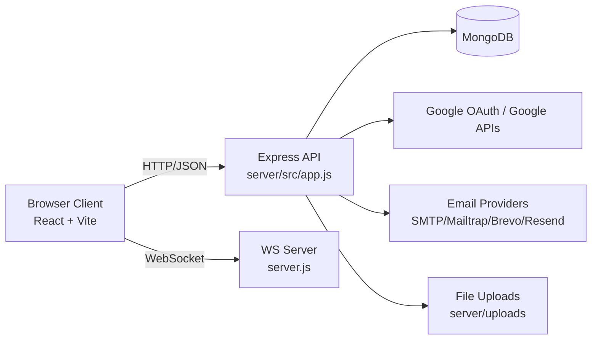

# LMS Project Documentation

## 1. Project Overview

This repository contains a full-stack Learning Management System (LMS) for coding education, with gamification and social features.

- Frontend: React + Vite (`client/codingo`)
- Backend: Node.js + Express + MongoDB (`server`)
- Realtime: WebSocket chat (`ws`)
- Authentication: JWT + optional Google OAuth

Main product capabilities include:

- User registration/login and profile management
- Course catalog, enrollment, and progress tracking
- Challenges and badges
- Community posts/comments/likes
- Friends/social graph and leaderboard views
- Realtime private messaging
- OTP-based auth support (separate endpoint group)

---

## 2. Monorepo Structure

```text
LMS/
  package.json
  README.md
  PROJECT_DOCUMENTATION.md

  client/
    codingo/
      package.json
      vite.config.js
      src/
        App.jsx
        main.jsx
        pages/
        components/
        redux/
        lib/

  server/
    package.json
    server.js
    src/
      app.js
      routes/
      controllers/
      models/
      middlewares/
      services/
      utils/
      db/
      jobs/
    uploads/
      post-images/
      profile-pics/
```

---

## 3. Architecture Summary



Backend startup flow (`server/server.js`):

1. Load environment variables.
2. Connect MongoDB.
3. Ensure default badges.
4. Run reconciliation and schedule recurring jobs.
5. Start Express HTTP server.
6. Attach WebSocket server for chat.

---

## 4. Frontend App (client/codingo)

### 4.1 Stack

- React 19
- React Router
- Redux Toolkit + React Redux
- Vite
- Tailwind CSS
- Axios
- CodeMirror integrations

### 4.2 Entry and Routing

- Entry point: `src/main.jsx`
- App shell and routes: `src/App.jsx`
- Protected routes rely on `/api/auth/user/me` auth check.
- Shared API client: `src/lib/api.js` (token interceptor + 401 handling)

### 4.3 Notable UI Areas

- Auth: login, signup, forgot/reset password, OAuth callback
- Learning: dashboard, levels, level detail, learn page, language pages
- Progress and leaderboard pages
- Social/community and comments
- Realtime messaging page

---

## 5. Backend App (server)

### 5.1 Stack

- Node.js + Express 5
- MongoDB + Mongoose
- JWT auth
- Passport Google OAuth2
- WebSocket (`ws`)
- Multer (uploads), Sharp (image processing)
- Node cron jobs

### 5.2 API Mount Points (`server/src/app.js`)

- `/api/auth`
- `/api/learning`
- `/api/challenges`
- `/api/badges`
- `/api/community`
- `/api/social`
- `/api/chat`
- `/api/otp`

Static uploads are served from:

- `/uploads`

---

## 6. API Endpoint Index

The following is a route index grouped by module. Full handlers live in `server/src/controllers`.

### 6.1 Auth (`/api/auth`)

- `POST /user/register`
- `POST /user/login`
- `GET /user/me` (protected)
- `GET /user/:userId/public`
- `PATCH /user/profile` (protected)
- `PATCH /user/profile/image` (protected)
- `GET /user/notifications` (protected)
- `PATCH /user/notifications/:notificationId/read` (protected)
- `PATCH /user/streak` (protected)
- `POST /user/rewards/claim` (protected)
- `POST /user/forgot-password`
- `POST /user/reset-password`
- `GET /user/logout`
- `GET /oauth/status`
- `GET /google`
- `GET /google/callback`

### 6.2 Learning (`/api/learning`)

- `GET /catalog` (protected)
- `GET /me/overview` (protected)
- `POST /courses/:courseSlug/enroll` (protected)
- `PATCH /courses/:courseSlug/progress` (protected)
- `GET /leaderboard` (protected)
- `GET /me/progress` (protected)
- `GET /me/activity` (protected)
- `GET /weekly-progress` (protected)

### 6.3 Challenges (`/api/challenges`)

- `GET /` (protected)
- `POST /:challengeId/claim` (protected)
- `POST /sync` (protected)

### 6.4 Badges (`/api/badges`)

- `GET /` (protected)
- `GET /earned` (protected)

### 6.5 Community (`/api/community`)

- `GET /feed` (protected)
- `GET /posts/image/:fileId`
- `POST /posts` (protected)
- `GET /posts/:postId` (protected)
- `DELETE /posts/:postId` (protected)
- `GET /users/:userId/posts` (protected)
- `POST /posts/:postId/like` (protected)
- `POST /posts/:postId/comments` (protected)
- `POST /posts/:postId/:commentId/likeComment` (protected)
- `POST /posts/:postId/:commentId/commentReplies` (protected)
- `DELETE /posts/:postId/comments/:commentId` (protected)

### 6.6 Social (`/api/social`)

- `GET /search`
- `GET /friend-requests`
- `POST /friend-request/:userId`
- `POST /friend-request/:requestId/accept`
- `POST /friend-request/:requestId/reject`
- `GET /friends`
- `GET /friends/leaderboard`
- `DELETE /friends/:friendId`

### 6.7 Chat (`/api/chat`)

- `GET /:recipientId`

### 6.8 OTP (`/api/otp`)

- `POST /send`
- `POST /verify`
- `POST /logout`
- `GET /me` (protected)

---

## 7. WebSocket Messaging

WebSocket server is created in `server/server.js` and supports at least these message types:

- `register`: associates userId to socket
- `chat-message`: persists message and forwards payload to recipient if connected

Connected clients are tracked in memory (`Map<userId, socket>`).

---

## 8. Environment Variables

Do not commit real secret values. Keep them in `server/.env` and frontend `.env` files.

### 8.1 Frontend (`client/codingo/.env`)

- `VITE_API_URL` (example: `http://localhost:5000`)
- `VITE_SOCKET_URL` (example: `ws://localhost:5000`)

### 8.2 Backend (`server/.env`)

Core app/auth:

- `PORT`
- `NODE_ENV`
- `MONGO_URI`
- `JWT_SECRET`
- `FRONTEND_URL`
- `BACKEND_URL`
- `PUBLIC_API_URL`

Google OAuth / Google APIs:

- `GOOGLE_CLIENT_ID`
- `GOOGLE_CLIENT_SECRET`
- `GOOGLE_REFRESH_TOKEN`
- `GOOGLE_DRIVE_FOLDER_ID`

AI integration:

- `AI_ENDPOINT_URL`
- `AI_API_KEY`
- `AI_MODEL_NAME`

Email/SMTP providers:

- `RESEND_API_KEY`
- `MAIL_FROM_ADDRESS`
- `MAIL_FROM_NAME`
- `SMTP_HOST`
- `SMTP_PORT`
- `SMTP_USER`
- `SMTP_PASS`
- `SMTP_FROM`
- `BREVO_API_KEY`
- `MAILTRAP_TOKEN`

OTP:

- `OTP_PEPPER`

---

## 9. Local Development Setup

## 9.1 Prerequisites

- Node.js (LTS recommended)
- npm
- MongoDB instance (local or cloud)

## 9.2 Install Dependencies

Backend:

```bash
cd server
npm install
```

Frontend:

```bash
cd client/codingo
npm install
```

## 9.3 Run in Development

Terminal 1 (backend):

```bash
cd server
npm start
```

Terminal 2 (frontend):

```bash
cd client/codingo
npm run dev
```

Frontend scripts (`client/codingo/package.json`):

- `npm run dev`
- `npm run build`
- `npm run lint`
- `npm run preview`

Backend scripts (`server/package.json`):

- `npm start`

---

## 10. Data and Domain Model (High Level)

Based on models in `server/src/models`:

- `user.model.js`: identity, profile, auth-linked data
- `userProgress.model.js`: learning metrics, XP/progress
- `courses.model.js`: course metadata
- `challenge.model.js` + `userChallenge.model.js`: challenge definitions and user completion
- `badge.model.js`: badges and reward metadata
- `post.model.js`: community feed posts/comments
- `messages.model.js`: chat messages and timestamps
- `otpCode.model.js`: OTP verification flow data

---

## 11. Known Technical Notes

- Root `package.json` currently has minimal dependencies and no workspace orchestration scripts.
- Social routes appear to be unauthenticated at route level; verify controller-level checks if required.
- OAuth routes in auth module gracefully fallback with 503 if Google strategy is not configured.
- WebSocket client mapping is in-memory; scaling to multiple backend instances will require shared state or pub/sub.

---

## 12. Suggested Next Improvements

- Add a root-level `dev` script to run frontend and backend concurrently.
- Add backend `dev` script with `nodemon`.
- Add OpenAPI/Swagger docs for all route groups.
- Add integration tests for auth, learning progress, and community workflows.
- Add a sanitized `server/.env.example` and `client/codingo/.env.example`.
